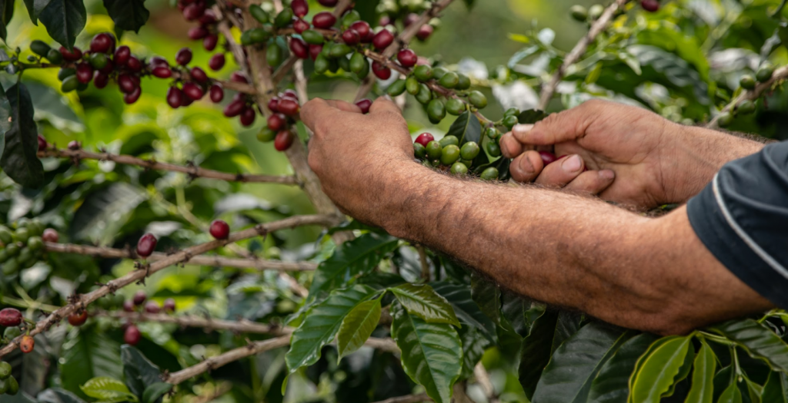

### What is Hilo?

[Hilo](https://hilo.cafe) is starting as a coffee startup. We want to connect consumers with families of coffee producers in Colombia and provide these farmers a dignified monthly income. The common practice in coffee trading is to pay farmers only when they provide coffee. Instead, the system we propose gives these families more stability and greatly reduces their needs to loan money when there are no beans available to sell. A stable life will also give these producers the chance, time and funds to implement more sustainable practices in their farming. Hilo also strives to improve their community, partnering with projects like [Jardín un municipio lector](https://www.facebook.com/Jard%C3%ADn-un-municipio-lector-1793507417442561/), which educates children (most of them from coffee farmer families) through literature.

However, this is only the tip of the iceberg for us. Hilo has been slowly evolving into a movement for social inclusion and sustainability. If you are interested in these topics, I suggest to keep up with [Hilo's blog](https://hilo.cafe/blog/) which will reveal and explore all these ideas in more detail. You can also directly [contact Hilo](https://hilo.cafe/transparency/) (or me), to learn more or even be part of the movement.

### My role inside Hilo

It was almost one year ago that I met [Martin Rojas](https://www.linkedin.com/in/mart%C3%ADn-rojas-arboleda-80940761), an energetic dreamer and founder of this startup. At the time it was all still an idea, but his eyes already sparkled with enthusiasm, imagining what it could one day become. I volunteered on the spot to help him with their website, at first sporadically, and, since the beginning of the year, with more commitment.

I closely worked with the [designers on the team](https://www.linkedin.com/in/tiagocvolpato/) to create the first version of the website: an online shop, a blog and other relevant information such as transparency. This was my first e-commerce and also Wordpress project, and it came with a good amount of new experiences and challenges: Participating on the writing of the data privacy and terms&conditions, host the website on a server or implementing two interchangeable languages (English and German). Wordpress and its plugins greatly simplify the bootstrapping of an online shop, however customizing it can become tricky when you want to keep inside a budget. One recent challenge was to adapt the design, look and information displayed on the automatic invoices which involved some PHP, HTML and CSS.

My role in Hilo keeps evolving to this day. From creating the page to decisions with the order flow or discussing marketing strategies. It becomes harder to describe what my role is, but becomes easier to say what I am responsible for. I suppose that is what being part of a startup feels like.

### Do you want to taste the coffee?

We are preparing everything to receive and sell a fresh new batch of roasted coffee. So, if you are interested, connect with Hilo through our [newsletter](https://cafe.us3.list-manage.com/subscribe?u=b9f06373c964d55d93a3b81ad&id=fb63a1f57a) or go ahead and [buy already your coffee](https://hilo.cafe/hilo-shop/), to be shipped soon enough to enjoy the begining of summer.

Meanwhile, Hilo will continue to grow, as a collective of people and as a movement. We have achieved so much in the last year, from a [successful crowdfunding campaign](https://www.startnext.com/hilocafe?utm_source=startnext&utm_medium=extwidget&utm_campaign=projectwidget&utm_term=projectpromo) to establishing an e-commerce. And the social and environmental reasons behind all these goals keeps me excited and looking forward to an even better future.

#### Hilo links:

- [Hilo Website](https://hilo.cafe)
- [Instagram](https://www.instagram.com/hilocafe.co/)
- [Linkedin](https://www.linkedin.com/company/hilo-cafe)
