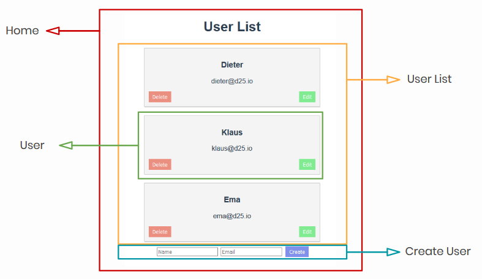

### The Motivation

In my previous company [d25.io](d25.io), we were discussing ways to engage with the tech community in Leipzig and spread the word about our start-up. Our CEO was hosting already an AI meetup but I wanted to take the challenge of doing something different.

After a quick look at the meetup events nearby, I found a lack of engagement with [Vue.js](http://vuejs.org) and I decided **"I am going to host a Vue.js workshop"**. The idea was simple, I work with this framework every day, as a front-end developer, so I could host a meeting where participants code a simple Vue application while learning the basic features of this JavaScript framework.

### The Vue.js basics workshop

Organizing the event was quite straightforward, I arranged a date and room at the [Basislager Coworking Space](https://www.basislager.co/), where I was working with the start-up, and shared [the event](https://www.meetup.com/d25-Developer-Talk-Leipzig/events/266461484/) on social media.

Making a sketch of the application I would like to build was also simple. After a couple of hours thinking and coding I arrived at a rudimentary [user management application](https://d25-user-list-tutorial.netlify.com/). A CRUD exercise where the most common Vue directives could be showcased while manipulating props between components.

The hardest part for me came after. **"How do I explain this?"**. The whole procedure seemed intuitive for me, but somehow putting into words the logic behind it left me with doubt that I could answer questions during the workshop. So I went back to basics and flew through the Vue.js documentation. Learned about best practices, how using keys on lists improves the performance of the Virtual-DOM, what happens under the hood when a **.sync** modifier is used among other details. I call them details since they can easily be overlooked on a developer's day-to-day, however knowing them helps avoid unnecessary pitfalls that can compromise the performance of the application.

Eventually, the day came, 4 people were in the workshop, half had worked with Vue before. We started building the application together, however as time went by, the participants chose to only focus on hearing my explanations and take small notes. This ended up being more productive since I could move faster, they could ask more questions and, after all, they had access to the GitHub repository of the project.

### Lessons Learned

I have to say, I learned more than I expected during the process. I know a bit better how to organize a coding workshop, what works and does not, but above all I became more confident as a developer. Investigating closely what happens under the hood of a framework gave me reinforced confidence when building features at work. Since this workshop, I already came across problems that I was able to swiftly avoid thanks to this deeper understanding.

I would then launch this challenge to all developers, pick a language/framework you work with and host a workshop. I believe you will be surprised by how much new information you were able to absorb during the preparation and how secure you feel working with it later.

#### Project links:

- [GitHub repository](https://github.com/deer-rodolfo/vue-user-list-tutorial)
- [Deployed Project](https://d25-user-list-tutorial.netlify.com/)
- [Meetup Event](https://www.meetup.com/d25-Developer-Talk-Leipzig/events/266461484/)
